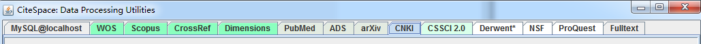

---
layout: post
title: "2019-04-25-citespace入门01"
date: 2019-04-25 13:15:00 +0800 
categories: 笔记
tag: [笔记]
---   

## citespace 简介

CiteSpace 软件是由美国德雷赛尔大学计算机与情报学教授陈超美开发的。这款软件的开发灵感主要来自库恩的科学结构演进观点，即“科学研究的重点随着时间变化，有些时候速度缓慢有些时候会比较距离”。CiteSpace 是 Citation Space 的简称，可译为 “引文空间”。CiteSpace 的重要用途在于通过可视化的方式分析和发现科学文献在蕴含的潜在知识，由于是通过可视化的方式了呈现科学知识的结构、规律和分布情况，因为也将该软件生成的图谱称为“科学知识图谱”（Mapping knowledge domains，MKD）。

CiteSpace 的理论基础可总结为五个方面：

- 托马斯库恩的科学啊发展模式理论
- 普莱斯的科学前沿理论
- 结构洞和克莱因伯格突发探测技术。
- 科学传播的最佳信息觅食理论
- 赵红州等人的知识单元离散与重组理论。

## 文献来源

CiteSpace 支持多种数据源来源的文献，包括：web of science、Scopus、PubMed、CNKI、CSSCI、Derwent*专利文献等，以及对文本进行格式转换的 Fulltext 转换，还支持将数据保存至 MySQL。

## 文献格式转换

占位~

## 参数调整

占位~

## 知识图谱解读

占位~

## ChangeLog

- 201904261300 init